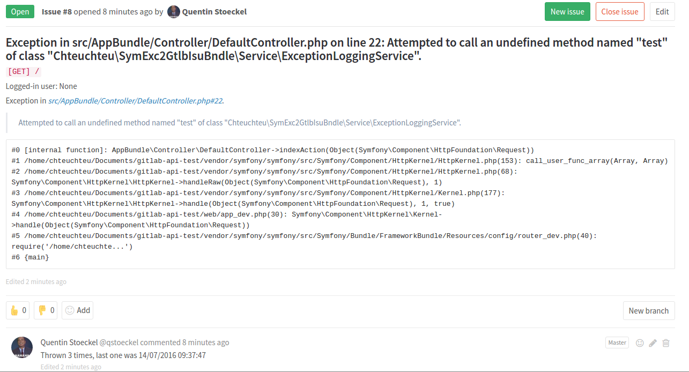

# SymfonyExceptions2GitLabIssuesBundle
*That's a very long name, but at least we know what it does.*

Once installed, this bundle will open/update an issue on your GitLab repository
when an exception is thrown:

- We build the issue title from the exception file, line and message
- If an issue exists with this title, we'll update it
- We put some relevant information in the issue body (request method (GET, POST, ...) & URI, logged in user, stacktrace)
- We add/update a comment: "Thrown 3 times, last one was 14/07/2016 09:37:47"

## Installation

1. Add this bundle to your project:

        composer require chteuchteu/symfony-exceptions-2-gitlab-issues-bundle

2. Register this bundle in symfony's kernel:

        // app/AppKernel.php
        public function registerBundles()
        {
            $bundles = array(
                // ...
                new Chteuchteu\SymExc2GtlbIsuBndle\SymfonyExceptions2GitLabIssuesBundle(),
            );
        }

3. Generate a GitLab API token. Navigate to [https://gitlab.com/profile](https://gitlab.com/profile) (replace the URL with
your instance's if necessary, but don't miss the `/profile` part), then "Personal Access Tokens".

    You can name it whatever you want, but "SymfonyExceptions2GitLabIssuesBundle" seems to be a great name.
    
    > Note: you can share this token between several projects.

4. Configure this bundle inside your project:

        # config.yml
        sym_exc_2_gtlb_isu_bndle:
            gitlab_api_url: https://gitlab.com/api/v3/
            gitlab_token: (put your token here)
            project: your_project_name
            excluded_exceptions:
                - Symfony\Component\HttpKernel\Exception\NotFoundHttpException

    > Note: if you're using https://gitlab.com, you can actually skip the `gitlab_api_url`. If not, don't forget the /api/v3/ part.

5. Deploy your app in production, and trigger an exception. An issue should be waiting for you in your GitLab repository.

6. *(optional)* Customize the `excluded_exceptions` node to include/exclude exceptions from being handled by this bundle.
By default (if the `excluded_exceptions` isn't specified), all exceptions are handled.

## Configuration
Here are some more things you can configure. Just add these items to your `config.yml`, under the `sym_exc_2_gtlb_isu_bndle`
node.

- `excluded_environments` - array, default `['dev']`:

    When encountering an exception in one of these environments, we won't report anything to your GitLab repository.
     
     > Tip: include back the dev environment (`excluded_environments: []`) to test this bundle without deploying to prod!

- `excluded_exceptions` - array, default `[]`:

    Array of FQCN (fully qualified class name) of exceptions to ignore.
    
    > Tip: add `Symfony\Component\HttpKernel\Exception\NotFoundHttpException` to ignore 404 exceptions.

- `mentions` - array, default `[]`:

    GitLab users to be mentioned in the issue body. Example: `['user1', 'user2', 'user3']` will append "Mentions: @user1 @user2 @user3"
    at the end of the message.

## TODO
- Make more things configurable:
   - Issue body template
   - Comment datetime format?
- Handle pagination when finding issue
- Test mode
- Help diagnose problems (monolog logging)
